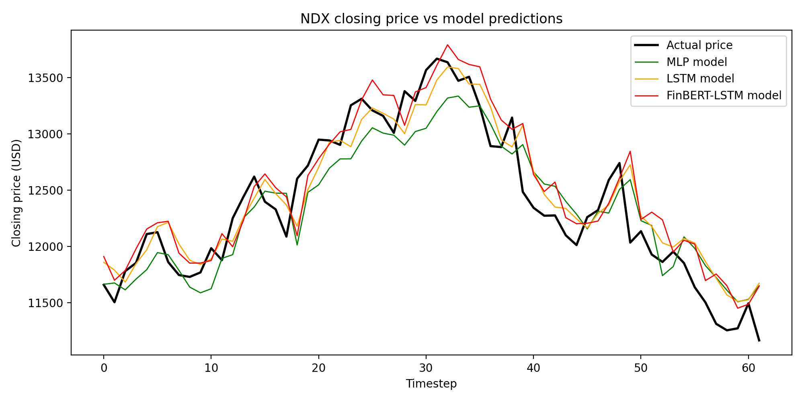

# Reproduction Results

## Table 1: Numbers of Daily Financial News and stock prices of dataset

| data | Daily Financial News and stock prices |
| --- | ---: |
| Training | 347 |
| Validation | 61 |
| Testing | 72 |
| Total no. of data | 480 |

## Table 2: Comparison of different approach in terms of performance

| Approach                | Testing loss   |    MAE |   MAPE |   Accuracy |
|:------------------------|:---------------|-------:|-------:|-----------:|
| Fin-BERT Embedding LSTM | 70,563.66356   | 217.01 |  0.018 |      0.982 |
| LSTM                    | 62,311.37480   | 204.35 |  0.017 |      0.983 |
| MLP                     | 80,534.32431   | 242.03 |  0.02  |      0.98  |

*Figure 1: Predicted vs. actual closing prices for the NDX test window.*
